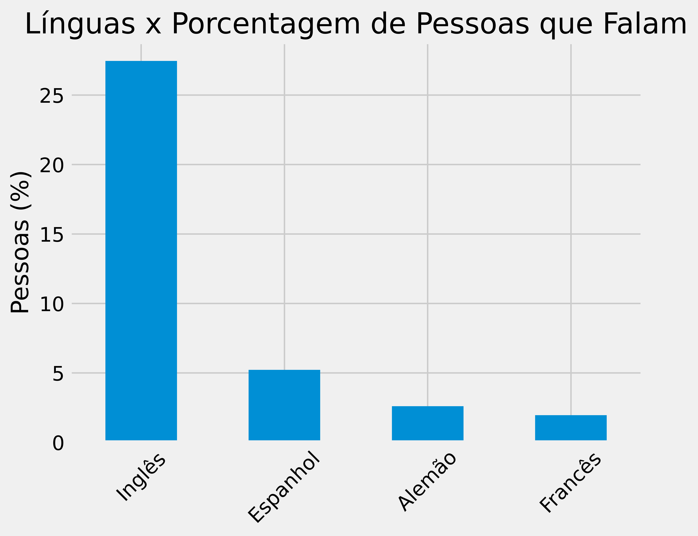

# Raspagem de Dados LinkedIn
Esse projeto tem como objetivo realizar a raspagem de dados do LinkedIn para fomentar análises sobre as informações de seus usuários. Em geral, o projeto consiste em procurar perfis de pessoas da região de João Pessoa, Paraíba, Brasil e minerar dados pertinentes de seus perfis. Na mineração, foram obtidos dados de idiomas, competências, interesses (empresas) e experiências. Esses dados foram armazenados em um banco de dados *sqlite3*, com cada tabela se relacionando através de uma ID de usuário (perfil). Ao final, foram gerados alguns gráficos que possibilitam analisar com mais profundidade os dados minerados.


## Dependências
As bibliotecas necessárias para executar esse projeto são:

- [sqlite3](https://docs.python.org/3/library/sqlite3.html) (nativa de python)
- [time](https://docs.python.org/3/library/time.html) (nativa de python)
- [bs4](https://beautiful-soup-4.readthedocs.io/en/latest/) (BeautifulSoup)
- [selenium](https://selenium-python.readthedocs.io/)
- [webdriver_manager](https://github.com/SergeyPirogov/webdriver_manager)
- [matplotlib](https://matplotlib.org/stable/index.html)
- [pandas](https://pandas.pydata.org/docs/)

A biblioteca *sqlite3* foi utilizada para comunicação com o banco de dados, desde sua criação até sua manipulação. A biblioteca *selenium* em conjunto com *webdriver_manager* foram utilizadas para conseguir acesso ao perfil do LinkedIn e navegar pelas páginas, fazendo pesquisas e minerando os dados. O *webdriver_manager* possibilita a instalação de um driver de browser (neste projeto foi utilizado o Chrome) para que a *selenium* consiga navegar. 

A biblioteca *time* foi usada nesse mesmo contexto, visto que é necessário esperar um tempo até que a página carregue por completo para que o HTML seja baixado por completo. A própria biblioteca *selenium* tem essa [funcionalidade](https://www.selenium.dev/documentation/webdriver/waits/), porém, não houve tempo hábil para que isso fosse implementado da maneira mais adequada e a biblioteca *time* foi escolhida para que o tempo fosse investido em outras partes do projeto. Por fim, as bibliotecas *matplotlib* e *pandas* foram usadas para gerar os gráficos que resumem os dados minerados neste projeto.


## Arquivos
Os arquivos deste projeto distinguem as etapas de criação do banco, pesquisa e mineração dos perfis (juntamente com criação da tabela de usuários do banco), mineração dos dados de cada perfil selecionado (juntamente com a adição desses dados no banco) e geração dos gráficos. Esses arquivos estão todos localizados no diretório ```source```. O arquivo ```utils.py``` é uma coleção das funções e constantes utilizadas pelos outros arquivos. O arquivo ```create_db.py``` é o responsável por criar o banco de dados, esquematizando as tabelas e determinando suas colunas e relações.

Os arquivos ```fetch_profile_urls.py``` e ```fetch_profile_data.py``` são responsáveis, respectivamente, por buscar as URLs dos perfis desejados e adicioná-las na tabela de usuários do banco e por minerar os dados de idiomas, competências, interesses e experiências de cada perfil e adicioná-los ao banco nas respectivas tabelas. Por fim, o arquivo ```graphs.py``` é responsável por gerar os gráficos com *insights* sobre os dados minerados.


## Utilização

Para reproduzir este projeto em seu computador, é necessário seguir alguns passos.

1. Criar um arquivo `config.py` com as variáveis `LINKEDIN_LOGIN` e `LINKEDIN_PASSWORD` para que esses dados fiquem protegidos de serem acessado por outras pessoas.

```
LINKEDIN_LOGIN = "login"
LINKEDIN_PASSWORD = "senha"
```

2. Instalar o requirements do projeto. Para isso, é recomendado criar um ambiente virtual e instalar os pacotes nele. Vale salientar que **versão de python** utilizada nesse projeto foi a 3.11.1.

```
pip install -r requirements.txt
```

3. Executar o arquivo ```create_db.py``` para que o banco de dados seja criado. O banco será criado no path ```DATABASE_PATH```. Caso queira criá-lo em outro local, basta alterar o valor dessa variável em ```utils.py```.

4. Executar o arquivo ```fetch_profile_urls.py``` para que os perfis sejam identificados e salvos na tabela de usuários do banco.

5. Executar o arquivo ```fetch_profile_data.py``` para que os dados de cada perfil sejam minerados. Nesta etapa é preciso ter atenção em relação ao repititivo acesso ao servidor do LinkedIn para que você não perca o acesso a sua conta.

6. Executar o arquivo ```graphs.py``` para que os gráficos sejam gerados. Eles serão colocados no diretório ```graphs```.

## Estrutura do Banco
O banco tem, no total, 6 tabelas: ```usuarios``` onde estão armazenados as URLs dos perfis juntamente com um ID para cada URL (ou perfil); ```linguas``` que armazena as informações de idioma e nível para cada idioma de cada perfil (a coluna de ```id_pessoa``` referencia a coluna de ID de ```usuarios```); ```competencias``` e ```interesses``` que armazenam, respectivamente, as competências e interesses associados a cada perfil onde, novamente, a coluna de ```id_pessoa``` de cada uma referencia a coluna de ID de ```usuarios```; e ```experiencias``` onde ficam armazenadas as informações das experiências de cada perfil. Essa tabela tem como colunas o cargo relacionado a cada experiência e suas datas de começo e fim, além de ter a coluna de ```id_pessoa``` que referencia a coluna de ID de ```usuarios```.

## Dificuldades
As maiores dificuldades encontradas nesse projeto dizem respeito a mineração dos dados. Tanto para iniciar a buscar por perfis de pessoas de João Pessoa, quanto para obter a URL de cada perfil e avançar na página de resultados da busca para encontrar mais perfis. Mesmo o LinkedIn afirmando haver cerca de 240.000 resultados na busca, só eram disponibilizadas 100 páginas de resultados. O algortimo criado conseguiu identificar 988 perfis diferentes entre essas 100 páginas. Além disso houve uma enorme dificuldade em minerar os dados específicos de idiomas, competências, interesses e experiências para **cada** perfil. 

Isso porque depois de acessar cerca de 150 perfis buscando esses dados, a plataforma proibiu meu acesso, impedindo que eu conseguisses os dados relativos aos 988 perfis selecionados. Por mais que tenha tinha uma pequena fração da quantidade de perfis desejadas, eu acredito que isso não alterou **significativamente** o resultado final. Como as análises têm seus alicerces na estatística, a tendência que a amostra segue já é visível nos dados minerados. A expectativa é que, utilizando os 988 perfis selecionados, os resultados ainda ficassem com a mesma estrutura.

## Resultados

Como resultados foram gerados 5 gráficos: dois que dizem respeito aos idiomas, e um para (cada) competência, interesses e experiência.

### Idioma




